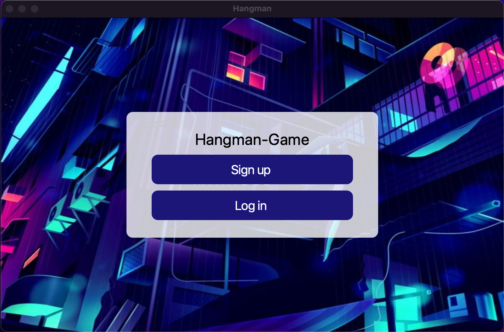
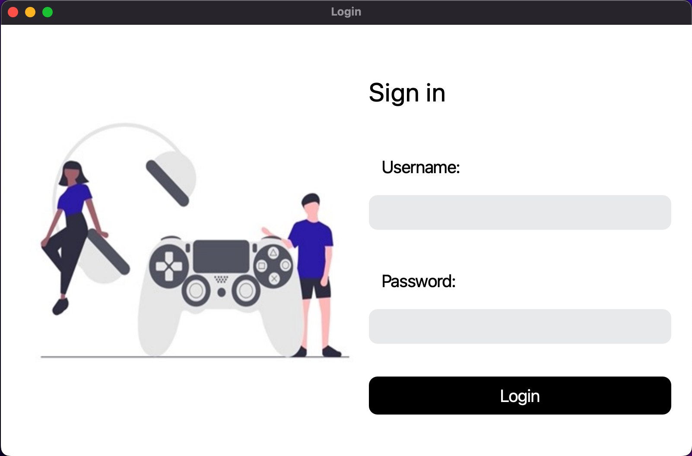
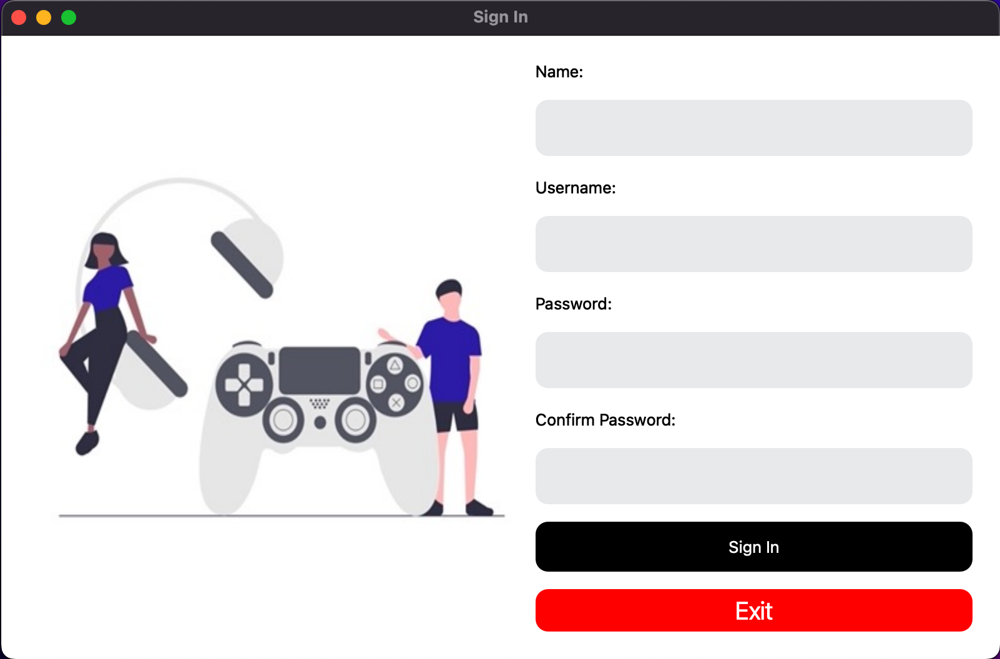
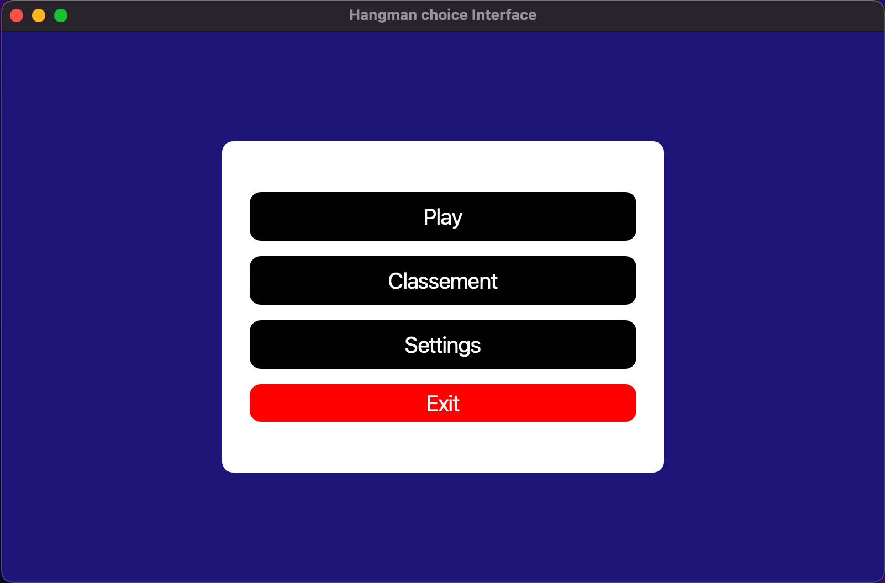
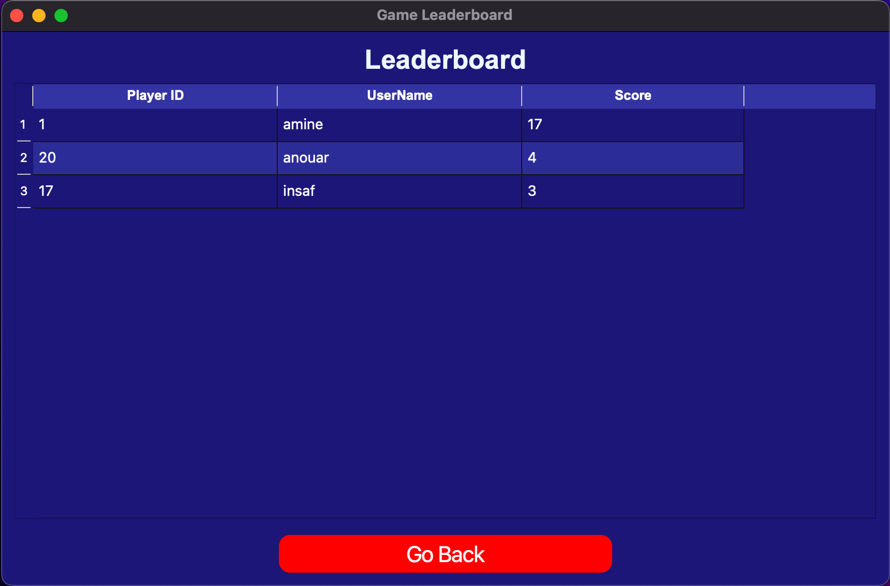
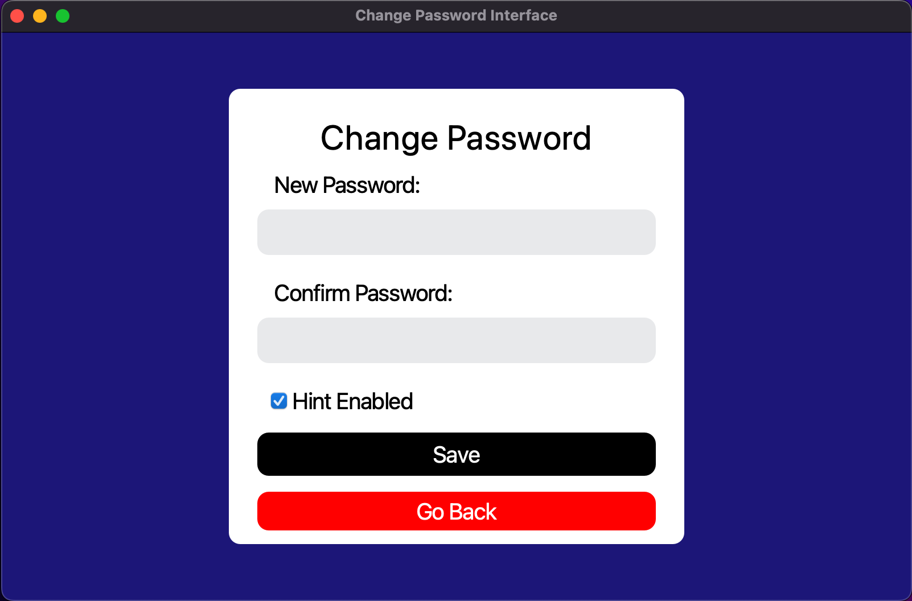

# Hangman Game

## Table of Contents

1. [Project Description](#description)
2. [Features](#features)
3. [Technologies Used](#technologies-used)
4. [Installation](#installation)
5. [Usage](#usage)
6. [Demo Video](#demo-video)
7. [Contacts](#contacts)
8. [Note](#note)

## Description

This project involves the development of an interactive Hangman game using Python, enhanced with a graphical user interface (GUI). Hangman is a classic word-guessing game where players attempt to guess a hidden word by suggesting letters within a certain number of guesses. If the player suggests a letter that is not in the word, a part of a stick figure (the "hangman") is drawn. The game ends either when the word is fully guessed or when the hangman is completely drawn.

## Features

- User authentication: Users can create accounts and log in to access the game.
- Play the game: Users can Play and access to their score and see their ranking.
- Hints : Provide hints to the player when enabled, such as giving a clue related to the word's category. With the option to enable or disable hints in the settings.
- 
## Technologies Used

- Python
- PyQt and Pyside6
- MySQL
- Apache

## Installation

1. Clone the repository: `git clone https://github.com/allaliamine/Hangman-project.git`
2. Set up Apache and MySQL server.
3. Import the `hangman.sql` to your database
4. Import the project into your preferred IDE (PyCharm, VScode, ...).
5. Change user, password, database name in the `conn.py` file

## Usage

1. Start Apache and MySQL Database server.
2. Access the application by running the `main.py` file.
3. Register for an account then log in.
4. Start playing the Hangman Game by chosing a difficulty and a topic.
5. Enjoy the game!

### User Interfaces
- Home Interface :

 

- Log in Interface :

 

 - Register Interface :

  

  - choices Interface :

  

  - Leaderboard Interface :

  

  - Settings Interface : 

  

## Demo Video

Watch our demo video to see the Hangman Game in action:

https://github.com/allaliamine/Hangman-project/assets/155643939/b8daeded-a4bd-4d7a-b93a-1699d01f5ebe

## Contacts

For any inquiries or feedback, please contact:
- <a href="https://www.linkedin.com/in/m-amin-allali/" target="_blank"> Allali Mohamed Amin </a> 
- <a href="https://www.linkedin.com/in/insaf-badri-588299248/" target="_blank"> Badri Insaf</a> 

## Note!!

- Some words have no hints.
- Some difficulties and topics have no words.
- The `hangman.sql` will add just some words and hints to the database. The user should create an account to play
